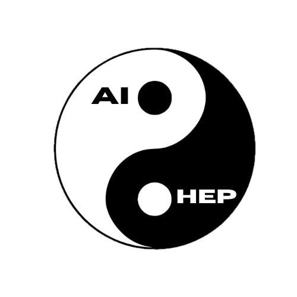

<div align="center">


# AI + HEP (East Asia) Website

**Community hub for advancing Artificial Intelligence in High Energy Physics across East Asia.**

Workshops • Seminars • Journal Clubs • Curriculum • Collaboration
</div>

## Overview

This repository contains the source for the [AI+HEP East Asia community website](https://ai-hep.github.io), built with **Jekyll** (GitHub Pages compatible) and a customized **Minima** theme.

## Repository Structure

```
docs/
├── _config.yml                # Jekyll site configuration
├── _layouts/
│   └── page.html              # Custom page layout (overrides Minima)
├── _includes/
│   └── header.html            # Custom header with logo
├── _sass/
│   └── (Sass partials)
├── assets/
│   ├── main.scss              # Global styles (theme, shared components)
│   └── css/
│       ├── 02-workshops.css   # Workshop page styles
│       ├── 03-seminars.css    # Seminars page styles
│       └── ...                # Other page-specific CSS
├── images/                    # All image assets (photos, logos, hero art)
├── index.markdown             # Landing page
├── 00-about.markdown          # About
├── 01-organizers.markdown     # Organizers & volunteers
├── 02-workshops.markdown      # Workshops
├── 03-seminars.markdown       # Seminars
├── 04-journalclubs.markdown   # Journal clubs
├── 05-curriculum.markdown     # Curriculum (under construction)
└── 06-projectboard.markdown   # Project board (under construction)
README.md                      # You are here
```

## Content & Styling Conventions

### Page content

Page content is written directly in markdown files. Each page uses YAML front matter for metadata:

```yaml
---
layout: page
title: Workshops              # Used in nav, SEO, and <title> tag
display-title: AI+HEP Workshops  # Shown on the page (optional)
subtitle: Annual events       # Shown below the title (optional)
permalink: /workshops/
order: 3
---
```

- `title` — appears in navigation, browser tab, and search engine results.
- `display-title` — if set, shown as the visible `<h1>` on the page instead of `title`.
- `subtitle` — displayed below the heading inside the hero banner.

### CSS organization

- **`assets/main.scss`** — global styles shared across all pages (variables, typography, nav, footer, buttons, shared components like `.highlight-box`).
- **`assets/css/<page-name>.css`** — page-specific styles. These are auto-loaded based on the page filename (e.g., `02-workshops.markdown` loads `assets/css/02-workshops.css`). No front matter needed.

When adding page-specific CSS, create a file in `assets/css/` matching the page filename. Keep page CSS self-contained — include all styles needed for that page's unique components rather than relying on shared classes where possible.

### Writing content

Maximize the use of markdown for readability — page source files should be easy to read as plain text, even without rendering. Use Kramdown features for adding classes to elements when needed:

```markdown
{:.workshop-photo .workshop-photo--pos-50}

[Event Page](https://example.com){:.btn .btn-outline target="_blank" rel="noopener"}
```

### Overriding Minima theme files

To customize a Minima theme file, create a file with the same path in the `docs/` directory. Jekyll will use the local version instead of the gem's. For example, `_layouts/page.html` overrides Minima's default page layout.

Run `bundle info minima` to find the gem's installed path and see the original files.

## Getting Started (Local Development)

1. Clone the repository:

   ```bash
   git clone https://github.com/ai-hep/ai-hep.github.io.git
   cd ai-hep.github.io/docs
   ```

2. Install Ruby dependencies (see [Jekyll docs](https://jekyllrb.com/docs/) for prerequisites):

   ```bash
   bundle install
   ```

3. Serve locally:

   ```bash
   bundle exec jekyll serve
   ```

4. Open <http://127.0.0.1:4000>.

Note: changes to `_config.yml` require restarting the server.

## Suggestions & Requests

If you have ideas for new features, content, or tools you'd like to see on the website, feel free to open an [issue](https://github.com/ai-hep/ai-hep.github.io/issues) or contact the webmasters.

## License

This project is licensed under the **BSD 3-Clause License** (see `LICENSE`).

Third-party components:
- Minima Jekyll Theme — MIT License (see `THIRD_PARTY_NOTICES.md`)
- GitHub Pages build toolchain — Various OSS licenses

By submitting a Pull Request you agree your contribution may be incorporated and redistributed under the project's license terms.

## Contact

For questions or broader reuse requests, contact the [organizers](https://ai-hep.github.io/organizers/) or the webmasters.

## Webmasters

- **Sung Hak Lim** — [sunghak.lim@ibs.re.kr](mailto:sunghak.lim@ibs.re.kr)
- **Shivasankar K.A** — [a-shiva@particle.sci.hokudai.ac.jp](mailto:a-shiva@particle.sci.hokudai.ac.jp)

You can also reach us via the AI+HEP Slack workspace.
